https://github.com/ABegay3853/CS3203-Midterm-ABegay.git

# Adarius Begay CS3203 Midterm

## Page Screenshots

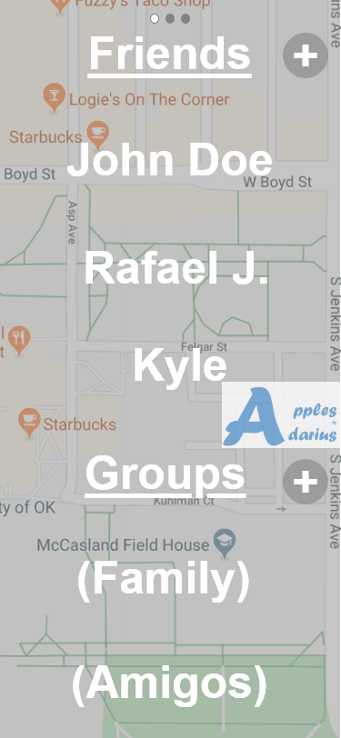

## Page Connections
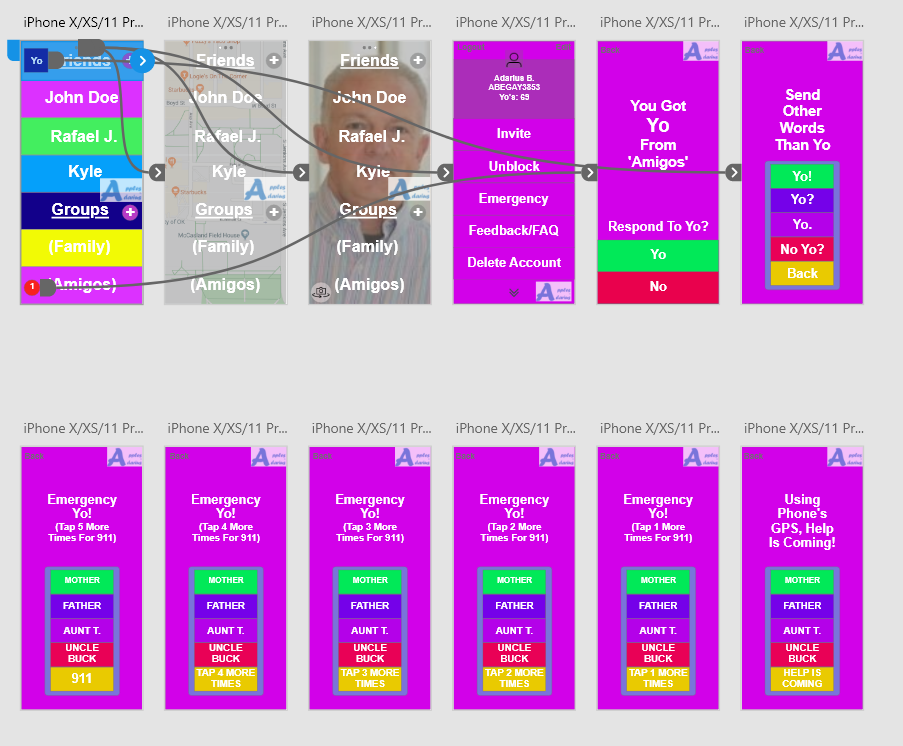
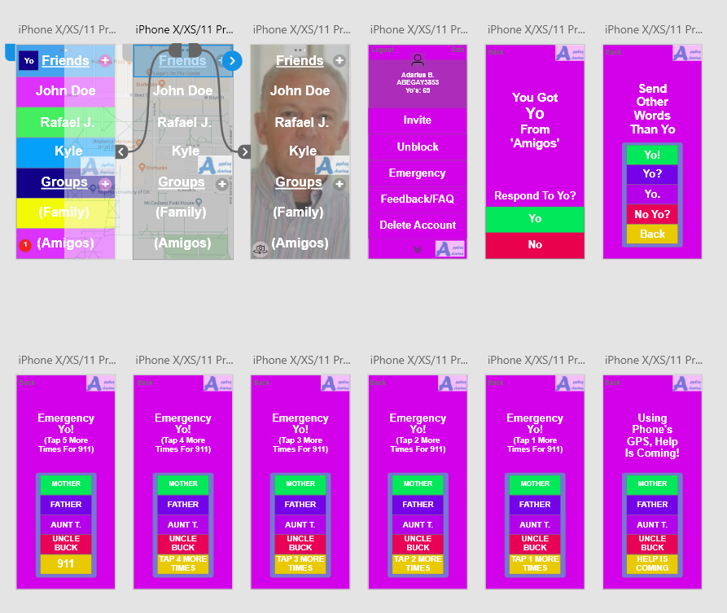
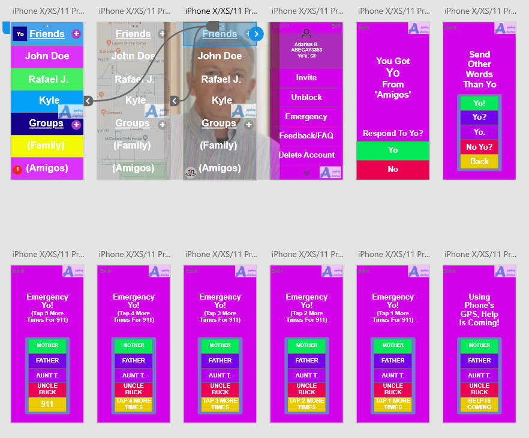
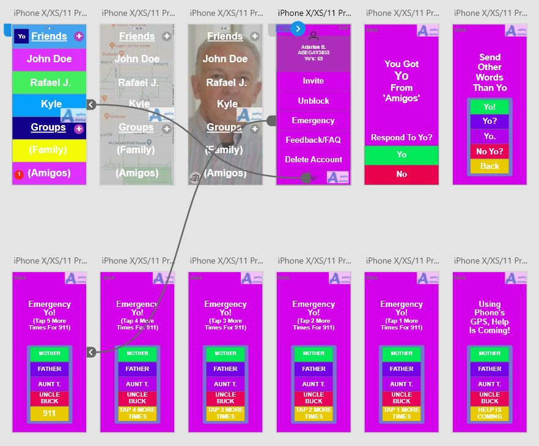
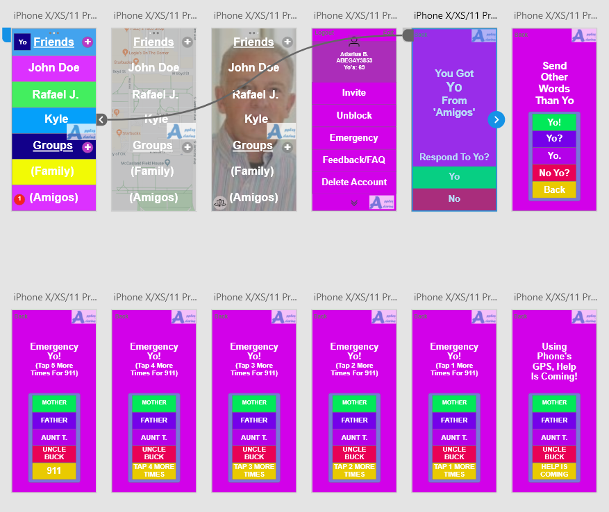
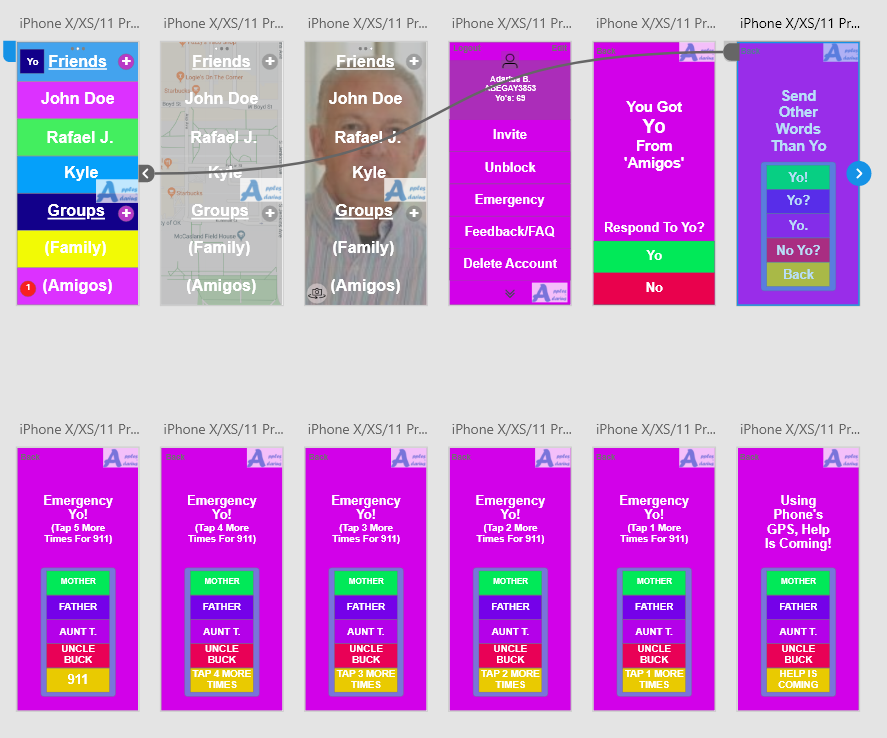
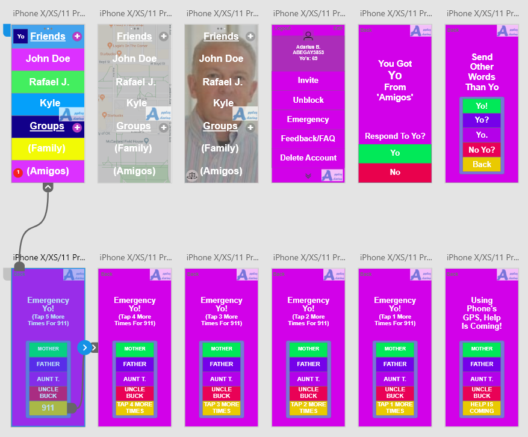
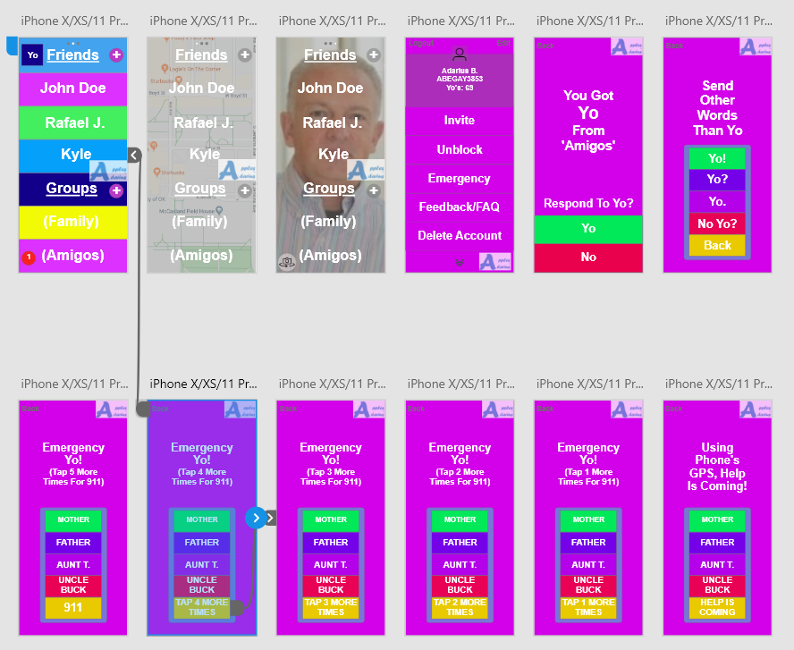
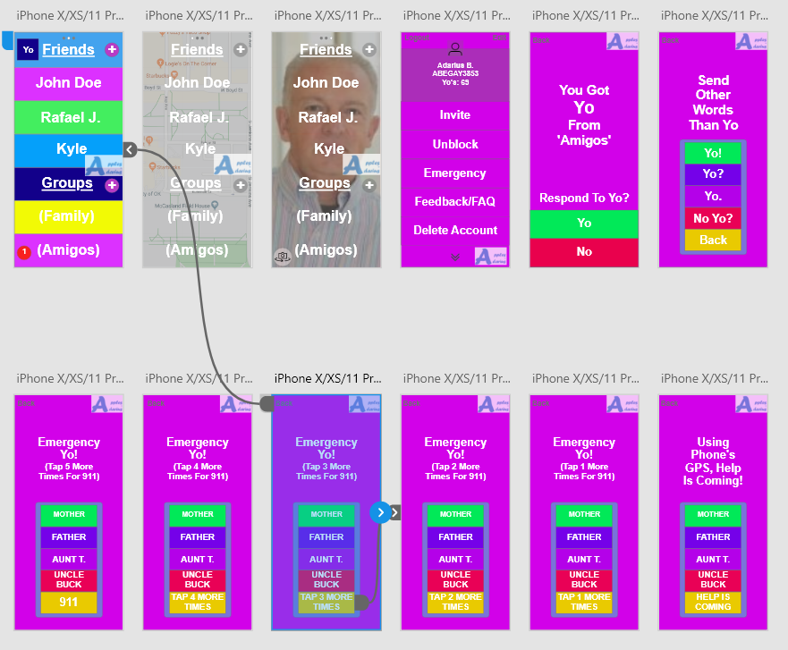

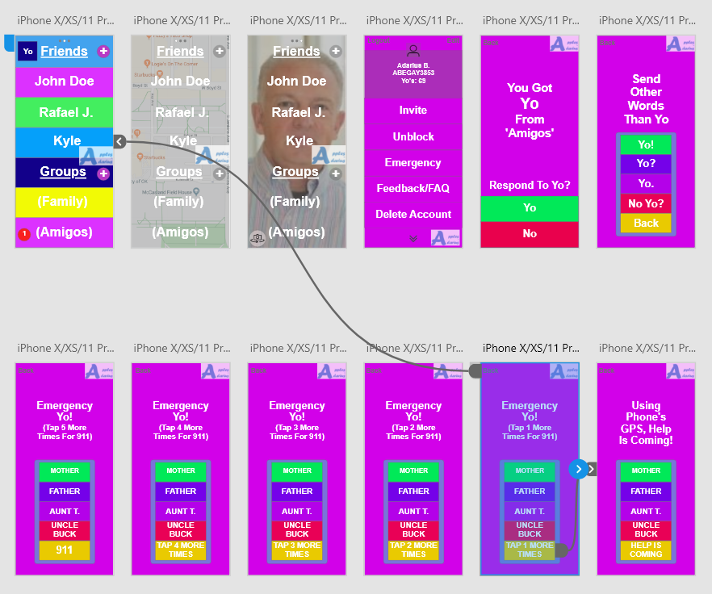
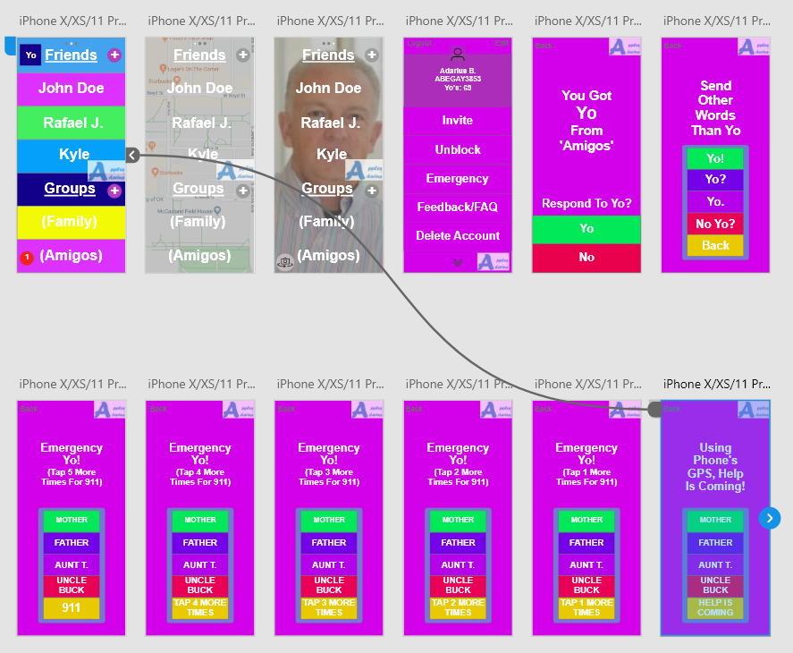

## Ethical Issues
1. The Yo feature with tapping 5 times for emergencies is an important ethical issue as it 
allows the user to be safe when walking around, especially when talking with some random person
in the park and they still have their phone in their hand. They will simply be able to tap multiple
times rather than try to send some cryptic message to a friend.
1. Work is respected with the new feature that we added with different types of Yo's you 
can send. You may only have Yo to communicate and sometimes you may need to say "No" rather 
than "Yo" when someone sends you a picture via Yo.
1. Confidentiality is given through our work with the new Yo notification system. This allows are
users to choose to respond or not when receiving a Yo. This can help them filter through all the
different Yos they may get on a given day and respond/not respond to many of them.

## Legal Issues
1. A legal issue that may arise from the feature of the tapping is that watches are starting to
integrate it themselves, of course the user can then describe that it is the safety of the user
that is the most important so their should be no rule to restrict something that may be similar
to an already established product.
1. The feature that allows notifications to be sent to the user and be asked if they would like
to respond will not have any legal issues as it simply is just a response to the user, which in
turn is like any other social media or messaging app out there.
1. Sending other words than Yo will provide great variety and not face any legal issues that will
provide any user any harm.

## Professional Issues
1. Professionally, the response may be quick to a specific user should they need an urgent Yo to
be sent and filter throughout the mess of other Yos someone may receive.
1. The emergency use can also be sent to coworkers should a work emergency arise (although that is
not the intended use of the feature but can be used like that).
1. The use of other Yos may provide a great way for poll making within meetings. If votes were to
be cast, then having different varieties of Yo may prove to be helpful.

## Countries Group Members Used
James Martindale - China
Sarath Sunkar - India
Bryant Hall - Japan
Adarius Begay - South Korea

## Storage Data for South Korea
Key principles include transparency, lawful basis for processing, purpose limitation, data
minimisation, proportionality, and retention.

Individual rights are:
Right of access to data/copies of his/her own data.
Right to rectification of errors.
Right to deletion/right to be forgotten.
Right to object to processing.
Right to restrict processing.
Right to data portability.
Right to withdraw consent.
Right to object to marketing.
Right to complain to the relevant data protection authority(ies).
Liability related to the processing of personal data.
